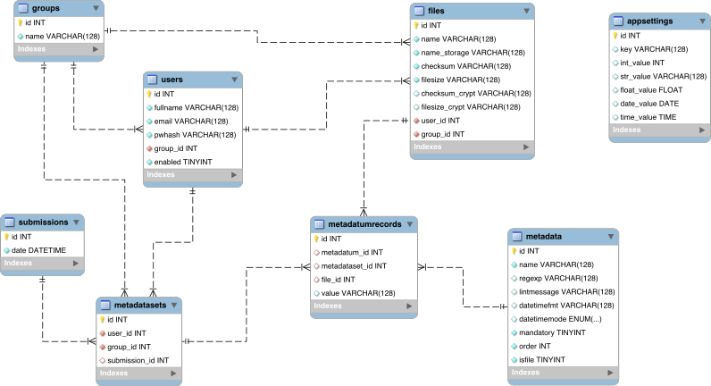
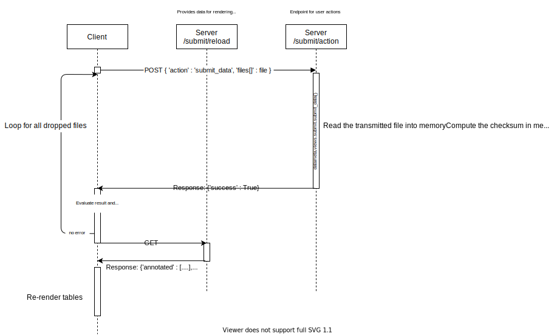

# Application Features

## Introduction

The DataMeta application stack comprises three main applications:

* The web application (aka DataMeta)
* A [memcached](https://memcached.org/) server
* A [PostgreSQL](https://www.postgresql.org/) database server

### Relational data model

The relational database model comprises the following entities:

* **User**

  A database user, uniquely identifiable by their email address. The attributes are pretty self explanatory. A user can be disabled but should not be deleted to maintain tracability of submitted records.
* **Group**

  Every user is associated with exactly one group.
* **File**

  A file corresponds to a single file submitted by the user. It holds the following attributes:
  * `name` - The original name of the file as submitted by the user
  * `name_storage` - The name under which the file is stored in the storage backend. The webapp uses a fixed naming scheme for this purpose which ensures that the filename is unique on the storage backend:
    `{file_id.rjust(10,'0')}_{user_id}_{group_id}_{file_size}_{md5_checksum}`
  * `checksum` - The MD5 checksum, computed immediately after upload
  * `filesize` - The filesize of the file
  * `checksum_crypt` - The checksum of the file after encryption
  * `filesize_crypt` - The filesize of the file after encryption
  * `user_id` - The UID of the user who uploaded the file
  * `group_id` - The GID of the user who uploaded the file (see User and Group)
* **MetaDatum**

  A metadatum describes a datum conceptually, it does not hold any data. It thus corresponds to a column in the submitted sample sheet, but not to the data held in that column. The corresponding table in the database is filled when values when the DataMeta instance is *configured* and typically remains static throughout the lifetime of the instance. However, there are scenarios in which one may want to add a new column in a later stage, modify the linting constraints defined for a column etc. Implementing this will require migration concepts for these events, e.g. old data may no longer pass linting.  A metadatum has the following attributes:
   * `name` - The name of the metadata. This defines the text required in the header of the corresponding sample sheet column.
   * `regexp` - A regular expression. If specified, it's applied to the field during linting.
   * `lintmessage` - A message to display in the interface when linting based on `regexp` failes, e.g. "Only three digits are allowed in this field".
   * `datetimefmt` - C standard date time format code string (see e.g. [here](https://docs.python.org/3/library/datetime.html#strftime-strptime-behavior)). If specified, the application assumes that this field holds a datetime value. When reading sample sheets from plain text formats (CSV, TSV) or if the corresponding column in a submitted Excel sheet is formatted as plain text, this format string is applied to parse the column values. Additionally, this format string is applied to display the values of this column in the user interface. *Note that date, time and datetime values are always stored as plain text datetime values in [ISO 8601](https://en.wikipedia.org/wiki/ISO_8601) format internally. The missing component falls back to 00:00 and 1900-01-01 respectively.*
   * `datetimemode` - An enum holding DATE, TIME or DATETIME. If set, denotes that the field should be treated as the corresponding type internally.
   * `mandatory` -  A flag indicating whether this field may be empty in sample sheets or not
   * `order` - An integer. When displaying the sample sheet in the user interface, the columns are shown in the order of their `order` values.
   * `isfile` - A flag indicating whether this column corresponds to a file.
* **MetaDatumRecord**

  Corresponds to one captured value of one metadatum. Every filled field in the sample sheet (except the header) corresponds to one MetaDatumRecord. Attributes:
    * `metadatum_id` - The ID of the metadatum this record corresponds to
    * `metadataset_id` - The MetaDataSet (see below) this record is part of.
    * `file_id` - If this metadatum record corresponds to a file and it has been submitted (see [Conceptual Notes](#conceptual-notes))
    * `value` - The plain text value of this metadatum
* **MetaDataSet**

  A metadataset corresponds to *one row* in the sample sheet. It groups all metadatum records that correspond to this row and additionally holds information about the owner of the metadata and whether it has been submitted (aka committed) or not. Attributes are:
  * `user_id` - The owner's UID
  * `group_id` - The owner's GID at the time of creation
  * `submission_id` - The submission ID once this metadata has been committed (see below).
* **Submission**

  A submission corresponds to the event of a user clicking the `COMMIT` button on the `/submit` view. It holds the time at which the submission took place.
* **AppSettings**

  A table holding application settings configured by the administrator running the DataMeta instance. This is currently not used.

## Conceptual Notes

1. *All captured metadata is treated as text internally*

   The generic application design, i.e. that the metadata fields can be defined dynamically at runtime, implies that there cannot be a 1:1 mapping of the sample sheet into the relational data model in form of a corresponding relation / table, unless one wants to go into the realm of using `CREATE / ALTER TABLE` at runtime. The current data model design stores all captured values in one attribute of one relation (`metadatumrecord.value`), which makes type reflection on the data model level impossible. At the same time, we're anyway accepting plain text formats such as CSV or TSV as input, thus all values that are to be held must be serializable anyway. Thus the `value` field of the MetaDatumRecord entity is `TEXT / VARCHAR`.

1. *Files and MetaDatumRecords are detached until submission*

   Until submission (aka commit), the data model does not link files and metadatumrecords. The integration of the file names and file uploads into the sample sheet (*Pending annotated submissions*) is purely visual on the client side through name-based matching. This is also utilized internally, i.e. to differentiate pending files from files that have been submitted, as files do not have a direct relation to a submission themselves. Only when a data record is submitted, files get linked to metadatumrecords and those get linked to a submission (via metadataset).

1. *Both files and metadatasets have owners*

   The previous point, i.e. pending files and metadatasets not being connected, requires that ownership is documented both on the file and on the metadataset level.

1. *Who has access to what data*

   What is shown on the `/submit` view is private to a UID/GID combination. Other members of the same group cannot access the pending submission, neither can the user himself in case they change their group. After submission, in the `/view` view, the user can see all submitted data from his group (not yet implemented).

## Application Cases

### Data File Submission

### Sample Sheet Submission

### Commit Submission

### Delete Pending Metadata Record

### Delete Pending Data File
