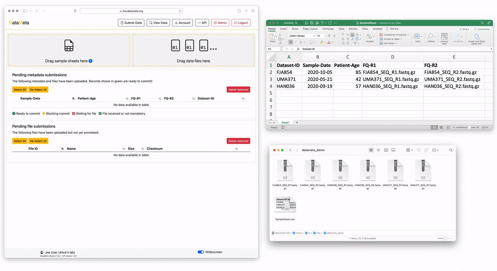

========
Overview
========

Data submission made easy! DataMeta allows you to easily define sample
sheet columns, value constraints for the sample sheet and columns which
are associated with raw data file names.

DataMeta is quick and easy to deploy on your local infrastructure and
scales for high numbers of users!

Contents:

.. toctree::
   :hidden:

   self

.. toctree::
   :maxdepth: 2

   application_features
   install_local
   install_vscode
   rest_api_design
   open_api_specs
